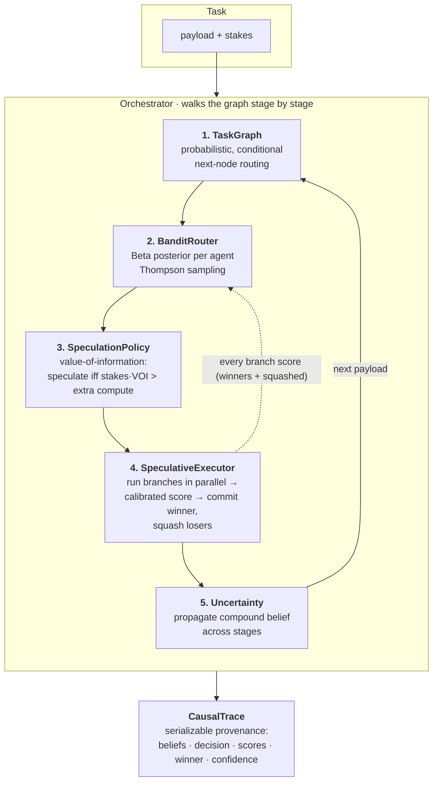

# PRISM

### Probabilistic Routing with Intelligent Speculative Multi-agent Orchestration

> Most "AI orchestration" projects are thin wrappers around a prompt chain. The
> genuinely hard, genuinely interesting problem is **how agents coordinate under
> uncertainty** — which agent to trust, when to hedge, and how to stay honest
> about what you don't know. PRISM is a small, dependency-free engine that
> tackles exactly that, by borrowing an idea from CPU architecture.

<p align="center"><em>Speculative execution for agent pipelines · online bandit routing · compound uncertainty · full causal provenance</em></p>

---

## The one idea

A modern CPU doesn't stall at a branch it can't resolve yet. It **speculatively
executes** down one (or both) paths, and when the condition finally resolves it
**commits** the correct path and **squashes** the wrong one.

PRISM does this for agents. When the router is genuinely unsure which agent is
best for a step, it doesn't gamble on one — it **speculatively runs several in
parallel**, scores their outputs, **commits the winner**, and **squashes the
losers**. Two twists make it more than a metaphor:

1. **It only speculates when the math says it's worth it.** A `value-of-information`
   model weighs the expected quality gain (scaled by how much the task matters)
   against the extra compute. Speculation is an *economic* decision, and the
   reasoning is recorded.
2. **Squashed work still teaches.** A CPU throws away mis-speculated work. PRISM
   feeds *every* branch's score — winners **and** losers — back into a bandit
   routing policy. So a "wasted" branch is never wasted: it sharpens routing for
   next time. Speculation is a hedge *and* an exploration engine at once.

The result is a system that speculates a lot while it's learning, then quietly
stops once it knows what works:

```
 tasks | oracle agree | spec rate (last 40) | realized quality
------------------------------------------------------------------
     5 |          2/4 |                 0.70 |            0.888
    10 |          3/4 |                 0.50 |            0.848
    25 |          4/4 |                 0.28 |            0.840
    50 |          4/4 |                 0.05 |            0.805
   100 |          4/4 |                 0.00 |            0.816
   400 |          4/4 |                 0.00 |            0.828
```
<sub>`python examples/03_bandit_convergence.py` — speculation buys information early, then self-tapers as the router grows confident.</sub>

---

## The five pillars

| # | Pillar | What it means | Where |
|---|--------|---------------|-------|
| 1 | **Probabilistic task graph** | Not a DAG. Edges carry *beliefs* about which transition is right and can be conditional on content. | [`graph.py`](src/prism/graph.py) |
| 2 | **Speculative multi-branch execution** | Run k candidate agents in parallel, commit the winner, squash + roll back the losers. | [`speculation.py`](src/prism/speculation.py) |
| 3 | **Online bandit routing** | Thompson sampling over a Beta posterior per agent; every outcome (incl. squashed ones) updates it. | [`routing.py`](src/prism/routing.py) |
| 4 | **Compound uncertainty** | Per-stage confidence is *composed* along the chain, so the final answer carries honest, compounding uncertainty. | [`uncertainty.py`](src/prism/uncertainty.py) |
| 5 | **Causal tracing** | Every output ships with a serializable record of *why* — beliefs, the speculate/commit decision, branch scores, winner rationale. | [`trace.py`](src/prism/trace.py) |

---

## Install & run (zero API keys, zero network)

Everything ships with reproducible **simulated** agents and a simulated scorer,
so you can see the whole system work before wiring in a real LLM.

```bash
pip install -e .

prism demo         # run one task, print its full causal trace
prism learn 100    # watch the bandit converge on the (hidden) best agents
prism benchmark    # PRISM vs greedy-only routing: quality vs compute

# or the annotated examples, one per pillar:
python examples/01_quickstart.py
python examples/02_speculation_in_action.py
python examples/03_bandit_convergence.py
python examples/04_uncertainty_propagation.py
python examples/05_causal_trace.py
```

A 15-line pipeline:

```python
from prism import Orchestrator, SimulatedAgent, SimulatedScorer, TaskGraph

graph = TaskGraph.linear("draft", "polish")
agents = {
    "draft":  [SimulatedAgent("fast-writer",    {"draft":  (0.72, 0.15)}, cost=0.5),
               SimulatedAgent("careful-writer", {"draft":  (0.80, 0.12)}, cost=2.0)],
    "polish": [SimulatedAgent("grammar-bot",    {"polish": (0.75, 0.13)}, cost=0.5),
               SimulatedAgent("style-llm",      {"polish": (0.83, 0.11)}, cost=2.0)],
}

orch  = Orchestrator.build(graph, agents, scorer=SimulatedScorer(0.9), seed=0)
trace = orch.run("Write a paragraph about tardigrades.", stakes=0.9)
print(trace.explain())
```

---

## What a run actually looks like

```
CAUSAL TRACE  ·  pipeline='triage'
  final confidence: mean=0.342 ± 0.120 (n=14.5)
  cost=8.7 units · latency=0.080s · speculations=2/4
  ├─ stage 0 [triage]  → greedy
  │    single-arm route → 'router-clf': value_of_info=0.074 ≤ extra_cost=0.105 — not worth it
  │    p_best={router-clf:0.43, cheap-llm:0.24, frontier-llm:0.33}  H=1.07 nats
  │      • router-clf     score=0.946 (0.74→0.77) ★ winner
  ├─ stage 1 [retrieve]  ⚡SPEC
  │    speculating over 2 branches: value_of_info=0.036 > extra_cost=0.036 (regret if committed=0.050)
  │    p_best={dense-retriever:0.54, hybrid-retriever:0.40, bm25:0.06}  H=0.86 nats
  │      • dense-retriever  score=0.954 (0.79→0.80) ★ winner
  │      • hybrid-retriever score=0.908 (0.75→0.76)  squashed
  │    propagated confidence → mean=0.613 ± 0.134
  └─ ...
```

Read stage 1 closely: the router was torn between `dense-retriever` (P(best)=0.54)
and `hybrid-retriever` (0.40). Rather than flip a coin, PRISM ran **both**, the
scorer preferred `dense-retriever`, and `hybrid-retriever`'s work was squashed —
*but its score still updated the bandit.* Stage 0, by contrast, wasn't worth
speculating on, so it committed to a single arm.

---

## System design



The loop per stage:

1. **Route.** `BanditRouter` holds a `Beta(α, β)` belief over each candidate
   agent's quality for this task type. `probability_best(...)` Monte-Carlos
   `P(arm is the best arm)`.
2. **Decide.** `SpeculationPolicy` estimates the expected regret of committing
   greedily and the `value of information` of running a branch set instead,
   scales it by `stakes`, and compares to the extra compute cost.
3. **Execute.** `SpeculativeExecutor` runs the chosen branch(es) in parallel
   (threads — real agents are I/O-bound LLM calls), scores each output, and
   **calibrates** the score against the prior (empirical Bayes — a lucky high
   score from a weak agent gets shrunk) before picking the winner.
4. **Learn.** Every branch's score updates its Beta posterior — winners and
   squashed losers alike.
5. **Propagate.** The winner's belief is composed into a running compound belief
   so the final answer's confidence reflects the *whole* chain.
6. **Trace.** All of the above is captured in a `CausalTrace`.

### The math, briefly

**Beliefs are Beta distributions.** Beta is the conjugate prior of Bernoulli, so
a soft reward `r ∈ [0,1]` updates in closed form — `α += w·r`, `β += w·(1−r)` —
no retraining. The mean `α/(α+β)` is the quality estimate; the variance shrinks
as evidence `α+β` grows. That variance is *epistemic* uncertainty — how much we
still don't know — and it's what drives the decision to speculate.

**When to speculate (value of information).** For candidate beliefs `θᵢ`, let
`g = argmaxᵢ E[θᵢ]` be the greedy pick and `B` a candidate branch set. One joint
Monte-Carlo pass estimates:

```
expected regret of committing greedily   R_greedy = E[ maxᵢ θᵢ − θ_g ]
value of running B (ideal scorer keeps best)  VOI  = E[ max_{b∈B} θ_b − θ_g ]
```

PRISM speculates iff `stakes · VOI · scorer_reliability  >  extra_compute · cost_weight`.
Crucially this fires on **wide, overlapping** beliefs (real uncertainty about
which is better, with upside) — *not* merely on close means. Two agents both
tightly pinned at 0.75 produce ≈0 VOI: you're confident they're equal, so it
doesn't matter which you pick. Try `examples/02_speculation_in_action.py`.

**Uncertainty compounds.** End-to-end quality is modelled as the product of
per-stage qualities. For independent `X, Y ∈ [0,1]`:

```
E[XY]   = E[X]·E[Y]
Var(XY) = (Var X + E[X]²)(Var Y + E[Y]²) − E[X]²·E[Y]²
```

We compute those exact moments and moment-match back onto a Beta, so confidence
can be composed down an arbitrarily long chain. Four strong 0.85±0.08 stages
compose to ~0.52 — and the uncertainty **grows**, it never silently vanishes.

---

## Plugging in real agents

`SimulatedAgent` is just a stand-in. Any object with `name`, `cost`, and
`run(task) -> AgentOutput` is routable. The provided `CallableAgent` wraps a
plain function:

```python
from anthropic import Anthropic
from prism import CallableAgent

client = Anthropic()

def synthesize(task):
    msg = client.messages.create(
        model="claude-opus-4-8", max_tokens=1024,
        messages=[{"role": "user", "content": task.payload}],
    )
    return msg.content[0].text

agent = CallableAgent("claude-opus", synthesize, cost=3.0)
# register it as an arm and PRISM will route, speculate, learn, and trace — as-is.
```

The one piece you supply for real workloads is a **`Scorer`** — your verifier:
an LLM-as-judge, a unit-test pass rate, a reward model, a schema validator.
PRISM's calibration step is designed to stay robust even when that judge is
noisy (that's why it fuses the raw score with the prior instead of trusting it
blindly).

---

## Benchmark

```
$ prism benchmark 300
  greedy-only            realized_quality=0.815  avg_cost=6.71  speculations/run=0.00
  PRISM (balanced)       realized_quality=0.817  avg_cost=6.95  speculations/run=0.09
  PRISM (aggressive)     realized_quality=0.827  avg_cost=7.85  speculations/run=0.60
```

`realized_quality` is the winners' **true** (hidden) quality — ground truth,
available only because the agents are simulated. PRISM trades compute for quality
along a tunable curve (`cost_weight`), exactly like a CPU trading power for IPC.
The gains here are deliberately modest because Thompson routing is *already*
strong; speculation's real value shows up most under **high judge reliability,
genuine near-ties, and high stakes** — see the design notes.

---

## Honest limitations

This is a research-grade showcase, not a production framework. It's transparent
about where the idea has edges:

- **Speculation multiplies cost.** k branches ≈ k× compute for that step. The
  economic model gates it, but if your `cost_weight` is wrong you'll over- or
  under-speculate. It's a knob, not magic.
- **Only as good as your scorer.** If the verifier can't tell good from bad,
  speculation can't cash in the value of running extra branches (that's what
  `scorer_efficiency` haircuts). Calibration against the prior softens this but
  doesn't eliminate it.
- **Independence assumptions.** The uncertainty composition treats stage
  qualities as independent; correlated failures (same model everywhere) will be
  under-estimated. A conservative simplification, chosen deliberately.
- **Rollback of external side effects** is cooperative: squashed branches with
  real-world effects (writes, emails, tool calls) must register a compensating
  action via `on_squash`. PRISM can't undo what it can't see.

See [`docs/ARCHITECTURE.md`](docs/ARCHITECTURE.md) for the deep dive and
[`docs/DESIGN_NOTES.md`](docs/DESIGN_NOTES.md) for the reasoning behind each
design choice and the alternatives considered.

---

## Layout

```
src/prism/
  uncertainty.py   Beta beliefs, moment-matched composition, P(best), entropy
  types.py         Task, AgentOutput, BranchOutcome, RouteMode
  agents.py        Agent/Scorer protocols, SimulatedAgent, CallableAgent
  routing.py       BanditRouter — Thompson sampling + online Beta updates
  scoring.py       calibrated (empirical-Bayes) winner selection
  speculation.py   SpeculationPolicy (VOI economics) + SpeculativeExecutor
  graph.py         TaskGraph — weighted, conditional, probabilistic
  orchestrator.py  the conductor that ties it all together
  trace.py         CausalTrace — human + JSON provenance
  scenarios.py     the shared "research assistant" demo pipeline
  cli.py           `prism demo | learn | benchmark`
examples/          one runnable, annotated script per pillar
tests/             pytest suite
docs/              architecture + design notes
```

## License

MIT — see [LICENSE](LICENSE).
